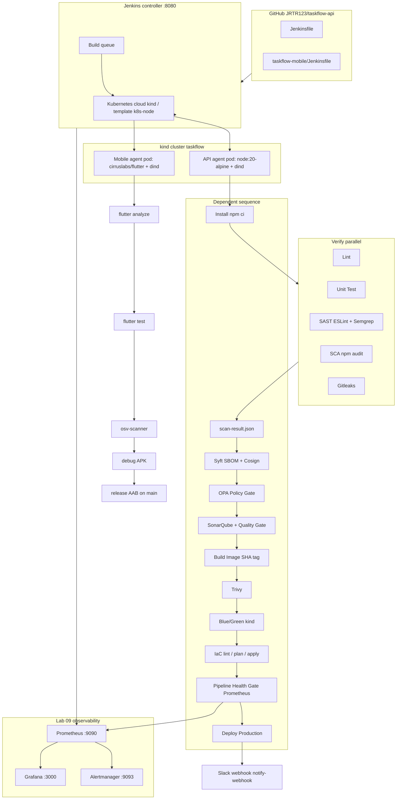

# Taskflow Lab 10 — architecture (one page)

## taskflow-api order

1. Agent Tools (docker CLI + kubectl + wait for dind)
2. Install
3. **parallel Verify:** Lint, Unit Test, SAST, SCA, Secrets Detection
4. Prepare Security Scan Result
5. SBOM + Sign (credential `cosign-pass`)
6. OPA Policy Gate — **blocks CRITICAL**
7. SonarQube Analysis + Quality Gate
8. Build Image → Container Scan → Blue/Green Deploy
9. IaC validate / tfsec / optional Terraform apply
10. Pipeline Health Gate — **blocks production if 24h success rate < 90%**
11. Deploy Staging (`develop`) / Deploy Production (`main` + `RUN_DEPLOY`)
12. post: Slack/email via `notify-webhook`

## taskflow-mobile order

Analyze → Test → SCA (osv-scanner) → debug APK (every branch) → signed AAB (`main` + `SIGN_ANDROID`)

## Credentials (Jenkins, never in Git)

| Id | Use |
| --- | --- |
| `cosign-pass` | Cosign key passphrase |
| `localstack-aws` | LocalStack access keys |
| `notify-webhook` | Slack incoming webhook |
| `android-keystore` / `android-storepass` / `android-keypass` / `android-keyalias` | Release AAB |
| SonarQube server config | `withSonarQubeEnv` |
